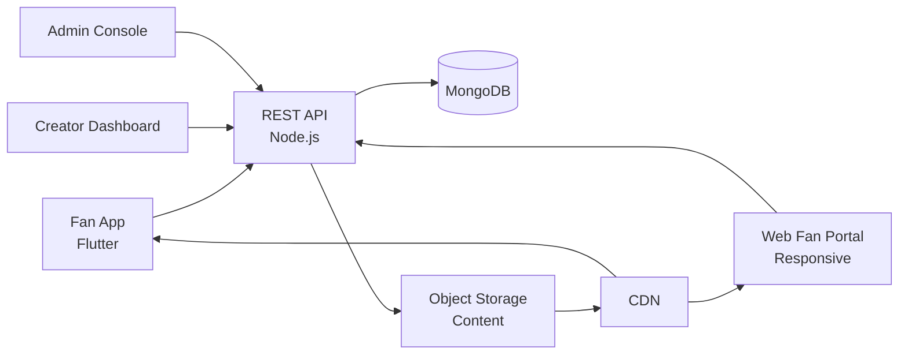

# Thrillz Clone — White-Label Creator Subscription & Fan Engagement Platform by Miracuves

**MXThrillz** is a production-ready, white-label Thrillz clone: a complete creator-economy platform with subscriptions, tips, PPV, and admin console — delivered with **100% source code ownership** in **6 working days**.

> ⭐ **See it running before you talk to anyone.** Live fan app, creator dashboard, and admin console — demo credentials are printed on the [solution page](https://miracuves.com/thrillz-clone#demo). No sales call required.

---

## 🚀 Live Demos

| Environment | URL | What you can test |
|---|---|---|
| 📱 Fan App | [mas.mimeld.com](https://mas.mimeld.com) | Subscribe, message, tip, exclusive content |
| 🌐 Web Fan Portal | [mxthrillz.mimeld.com](https://mxthrillz.mimeld.com) | Full fan experience in the browser |
| 🎨 Creator Dashboard | [Solution page → Demo](https://miracuves.com/thrillz-clone#demo) | Posts, tiers, messages, earnings, analytics |
| 🛠️ Admin Console | [Solution page → Demo](https://miracuves.com/thrillz-clone#demo) | Creators, fans, content, payouts |

Demo credentials for all environments: **[miracuves.com/thrillz-clone → Demo section](https://miracuves.com/thrillz-clone/#demo)**

---

## ✨ What Makes This Thrillz Clone Different

Most creator-platform scripts stop at "subscription page." This platform ships with the features that actually run a creator *business*:

- **Tiered Subscriptions** — multi-tier membership with monthly/yearly billing, free trials, gift subscriptions — same mechanics Patreon built on
- **Pay-Per-View & Tips** — PPV messages, locked media, tip jars — same monetization tools Fansly and OnlyFans use
- **Built-In Live Streaming** — low-latency live rooms with paid tickets, gift animations, and DM fan-outs — not bolted-on
- **AI DM Assistant** — helps creators triage 1000+ DMs/day with smart replies, sentiment analysis, and content moderation — saves creator hours
- **2257 / Compliance Stack** — U.S. 2257 recordkeeping, age verification, and DMCA takedown workflow — production-grade compliance, not a checkbox

## 📦 Core Features

**Fan:** subscribe to creators · unlock exclusive posts · send tips · DM creators · live sessions · community feed · multi-language

**Creator:** profile & branding · tier builder · post scheduler · DM inbox · tip & PPV tools · analytics · payouts · live streaming

**Admin:** KYC & payouts · content moderation · DM oversight · dispute resolution · analytics reports

## 🏗️ Architecture

**Stack:** Flutter mobile apps (Android + iOS) · Node.js backend · MongoDB + S3 for content · WebRTC for live · Stripe Connect for creator payouts · Stripe Connect, regional gateways, multi-currency

## 📋 What’s Included

- ✅ Full source code — backend, web, mobile apps, panels (no encryption, no license locks)
- ✅ Deployment to your servers & app store submission assistance
- ✅ Your branding — white-label rename, logo, colors, domain
- ✅ 60 days post-launch support + 12 months of free updates
- ✅ Documentation & handover

**Pricing:** from **$2,899**, transparent on the [solution page](https://miracuves.com/thrillz-clone/#pricing) — no "contact us for quote" games.

## 🆚 Why Not Build From Scratch?

Custom creator platforms run $80k–$400k and 5–10 months. A proven white-label base gets you to market in 6 working days for a fraction of that, with your budget preserved for creator outreach and growth marketing.

## 📚 Resources

- 📖 [Thrillz Clone — Full Solution Page](https://miracuves.com/thrillz-clone) (features, pricing, demos, FAQ)
- 💰 [How Much Does a Creator App Cost in 2026?](https://miracuves.com/thrillz-clone#pricing) pricing breakdown & what's included
- 📝 [Best Thrillz Clone Script in 2026](https://miracuves.com/thrillz-clone/blog/) features, pricing & launch guide
- 🧠 [Creator Economics: Subscriptions vs Tips vs PPV](https://miracuves.com/thrillz-clone/blog/) LTV by monetization mix
- ✅ [Miracuves Facts & Claims Ledger](https://miracuves.com/thrillz-clone/facts/) every claim we make, verified

## 🏢 About Miracuves

[Miracuves Solutions](https://miracuves.com) builds white-label clone apps and custom software from Mumbai, India — 90+ ready-made solutions, live demos for every product, transparent pricing, and delivery in 6 working days. Operating since 2010.

**Talk to us:** [WhatsApp](https://wa.me/919830009649) · [Schedule a consultation](https://miracuves.com/schedule-consultation/) · [miracuves.com](https://miracuves.com)

---

### ⚠️ Note on This Repository

This repository is a product overview. The full source code is delivered to clients on purchase — see [what’s included](https://miracuves.com/thrillz-clone/#included). For a hands-on evaluation, use the live demos above; credentials are public on the solution page.

*Keywords: thrillz clone, thrillz clone script, creator economy, fan subscription, white label Patreon, Flutter creator app, Node.js fan platform, subscription platform*

---

<!--
══════════════════════════════════════════════════
TEMPLATE VARIABLE KEY — auto-generated from Netflix-Clone pattern
══════════════════════════════════════════════════
{APP_NAME}        Thrillz Clone
{MX_NAME}         MXThrillz
{CATEGORY}        Creator Subscription & Fan Engagement Platform
{DEMO_WEB}        mxthrillz.mimeld.com
{PRICE}           $2,899
{SLUG}            thrillz-clone
{SOLUTION_URL}    https://miracuves.com/thrillz-clone/
{VERTICAL}        creator_economy

See /tmp/verticals/creator_economy.txt for the vertical config used to generate this README.
══════════════════════════════════════════════════
-->